<div id="top"></div>
<div align="center">

[![LinkedIn][linkedin-shield]][linkedin-url]

</div>
<!-- PROJECT LOGO -->
<br />
<div align="center">
  <div>
    
  </div>
  <div style="margin-top: -70px;">
    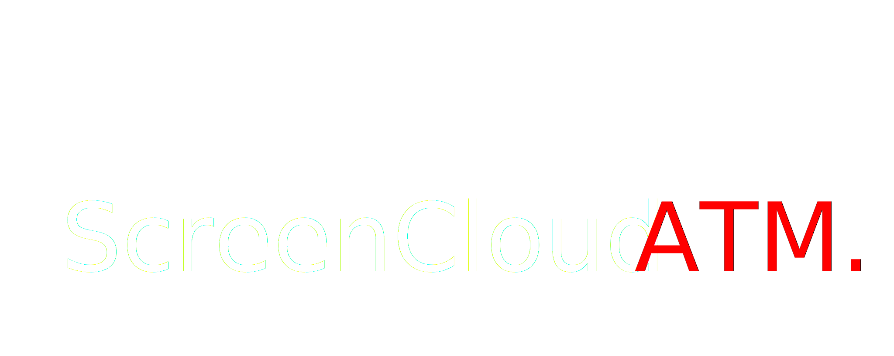
  </div>
  <p align="center">
    <a href="https://screencloud-atm-web.vercel.app" target=”_blank”><strong>View Frontend Demo »</strong></a>
    <br />
  </p>
</div>
<!-- TABLE OF CONTENTS -->
<details>
  <summary>Table of Contents</summary>
  <br />
  <ol>
    <li>
      <a href="#about-the-project">About The Project</a>
      <ul>
        <li><a href="#in-this-application-you-have-the-ability-to">Features</a></li>
        <li><a href="#built-with">Built With</a></li>
      </ul>
    </li>
    <li>
      <a href="#getting-started">Getting Started</a>
      <ul>
        <li><a href="#prerequisites">Prerequisites</a></li>
        <li><a href="#installation">Installation</a></li>
      </ul>
    </li>
    <li><a href="#contact">Contact</a></li>
  </ol>
</details>

<!-- ABOUT THE PROJECT -->

## About The Project

### Screenshots

<div align="center">
  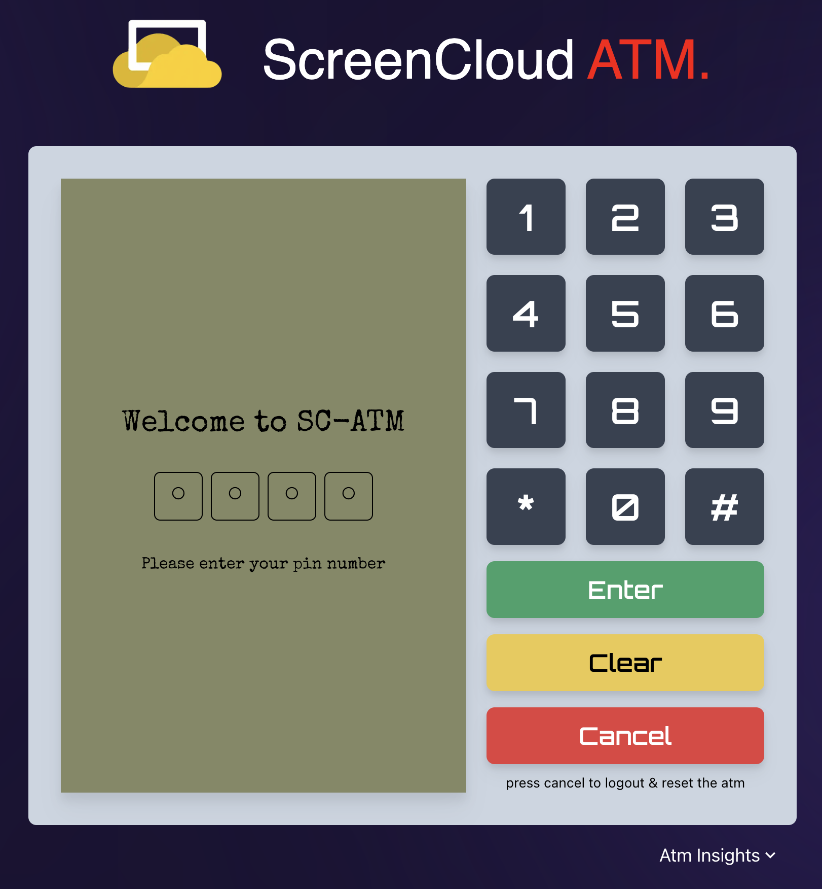
  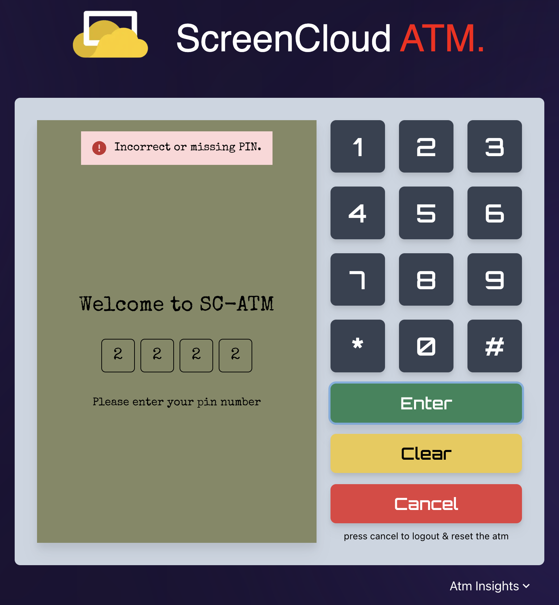
  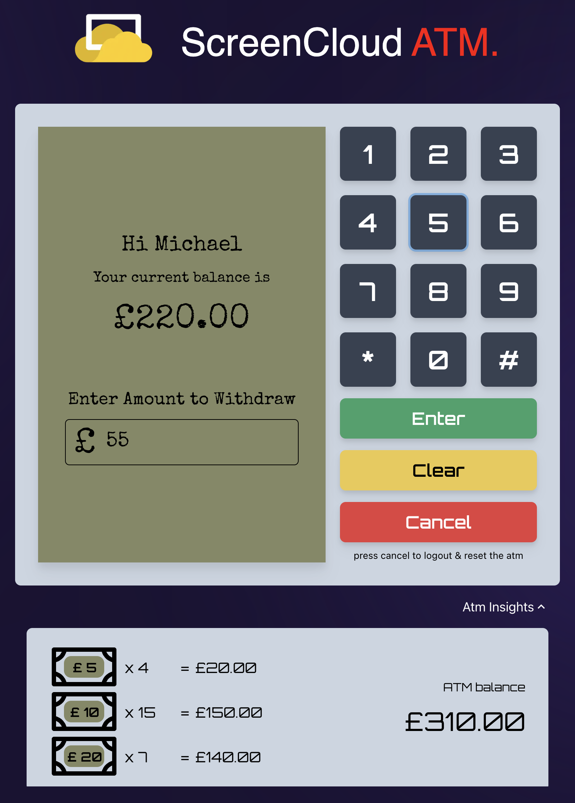
  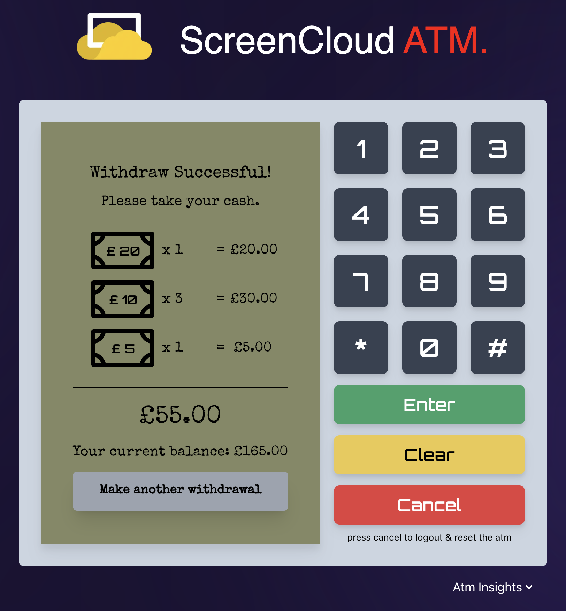
  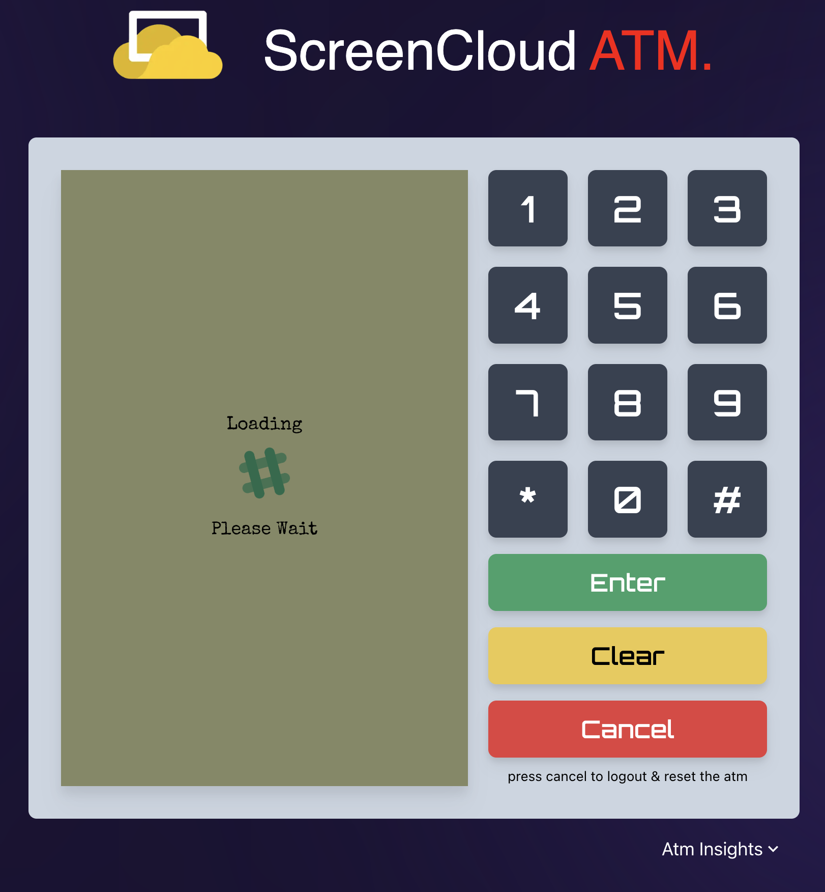
  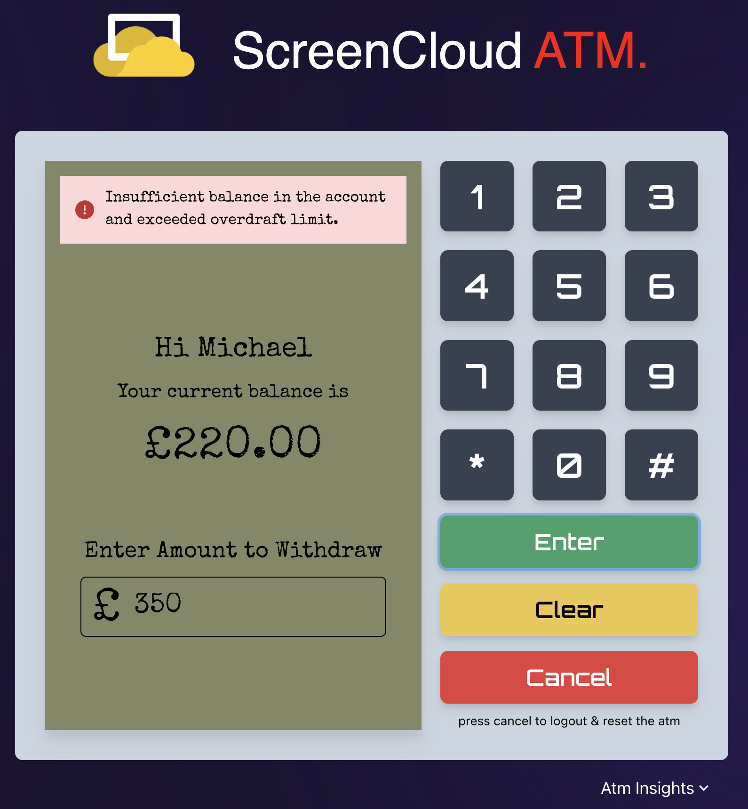
  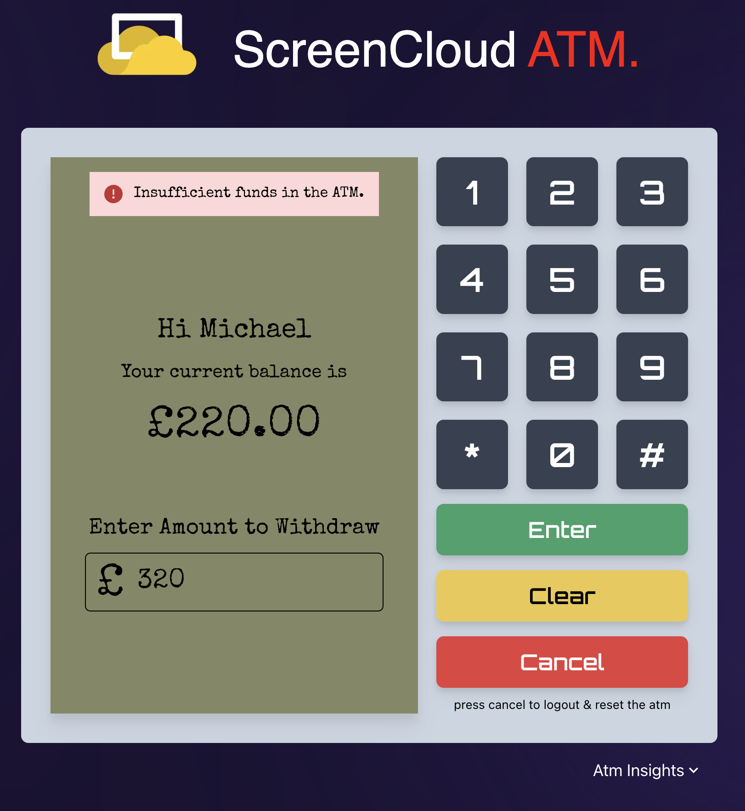
  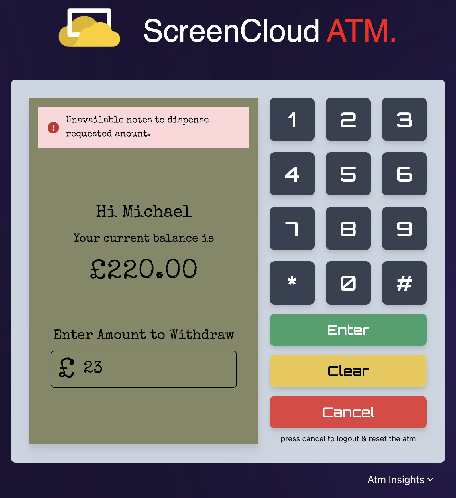
  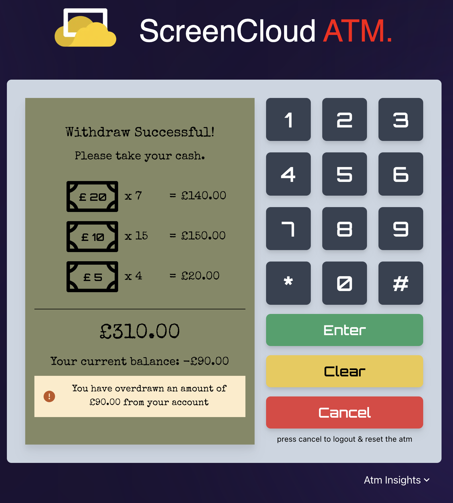
</div>
<br />

### In this Application you have the ability to

- Log into the ATM with the correct pin `1111`.
- Once logged in you'll be taken to the home page, which shows the account balance.
- You are allowed to withdraw an amount of `Your Account Balance + Overdraw Limit(£100)` max
- Once you submit the withdrawal, ATM will validate the amount to make sure if it's dispensable with the current balance in ATM Vault.
- If it's not dispensable, it'll show you the reason as an error message.
- If it's dispensable, It'll take you to the success screen to hand you over the currency notes.
- In the success screen you can see
  - The updated balance in your account
  - Warning message, if you have overdrawn from your account.
  - Button to make another withdrawal, only if your account balance and the ATM vault balance allows.

<p align="right">(<a href="#top">back to top</a>)</p>

### Built With

- [React.js](https://reactjs.org)
- [Next.js](https://nextjs.org/docs)
- [Typescript](https://www.typescriptlang.org)
- [Chakra UI](https://chakra-ui.com)
- [Tailwind CSS](https://tailwindcss.com)
- [Zustand](https://www.mongodb.com) State Management
- [Lodash](https://lodash.com)

I have used [Vercel](https://vercel.com/) to host this application to provide a quick preview to the observers.

<p align="right">(<a href="#top">back to top</a>)</p>

<!-- GETTING STARTED -->

## Getting Started

This is a [Next.js](https://nextjs.org/) project bootstrapped with [`create-next-app`](https://github.com/vercel/next.js/tree/canary/packages/create-next-app). with the typescript template.

### Prerequisites

Make sure you have node installed in order to run this application locally.

- upgrade npm to the latest version

```sh
npm i npm@latest -g
```

### Installation

1. Clone the repo.

```sh
git clone https://github.com/sudeshnt/screencloud-atm-web.git
```

2. Install node modules for the app using the following command

```sh
npm i
```

3. You can run following command to start dev server:

```js
npm run dev
```

4. Run the app in the development mode.

Open [http://localhost:3000](http://localhost:3000) to view it in your browser

5. Launch the test runner in the interactive watch mode.

```js
npm run test
```

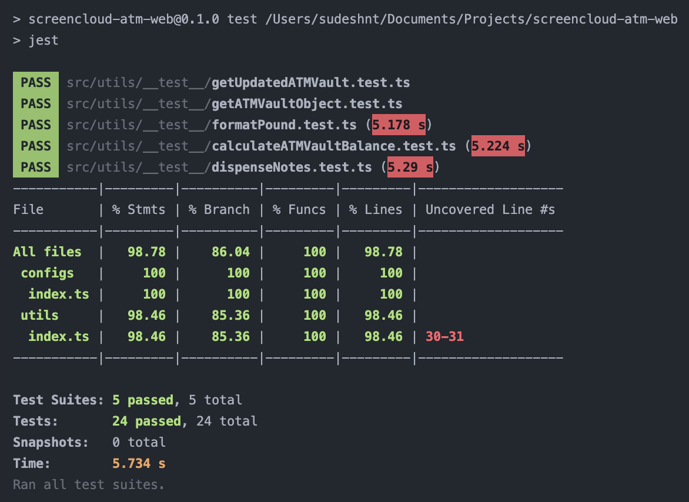

6. Builds the apps for production to the build folder.

```js
npm run build
```

<p align="right">(<a href="#top">back to top</a>)</p>

<!-- CONTACT -->

## Contact

Sudesh Nimesha - sudeshnt93@gmail.com

<p align="right">(<a href="#top">back to top</a>)</p>

<!-- MARKDOWN LINKS & IMAGES -->
<!-- https://www.markdownguide.org/basic-syntax/#reference-style-links -->

[linkedin-shield]: https://img.shields.io/badge/-LinkedIn-black.svg?style=for-the-badge&logo=linkedin&colorB=555
[linkedin-url]: https://www.linkedin.com/in/sudeshnt
